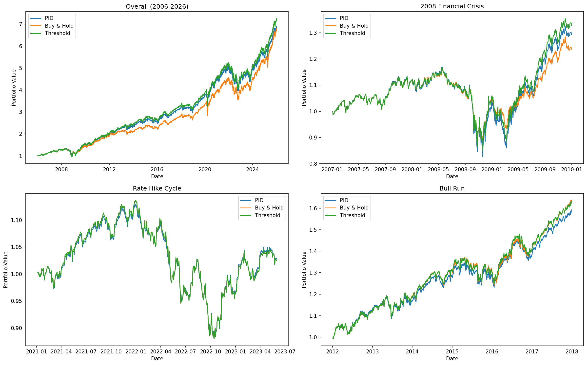
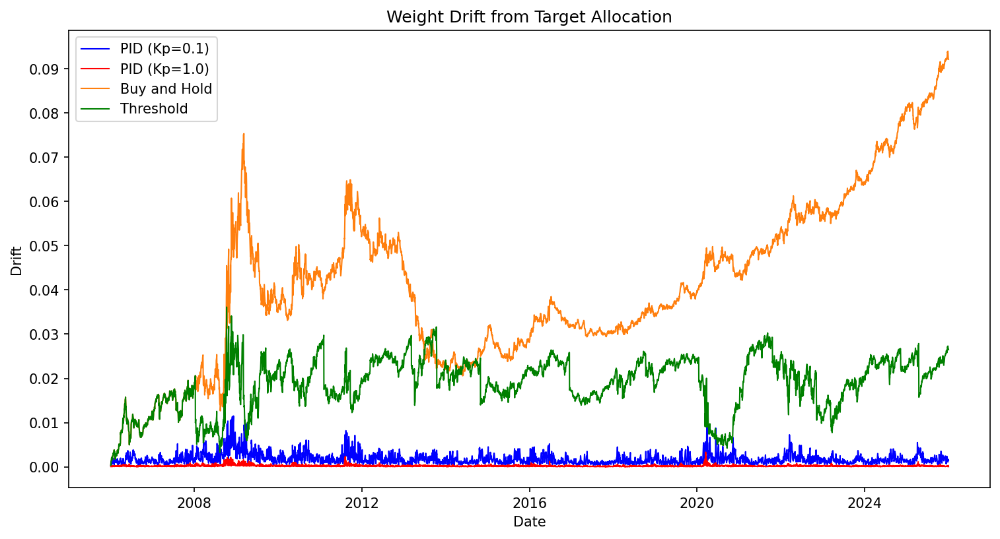
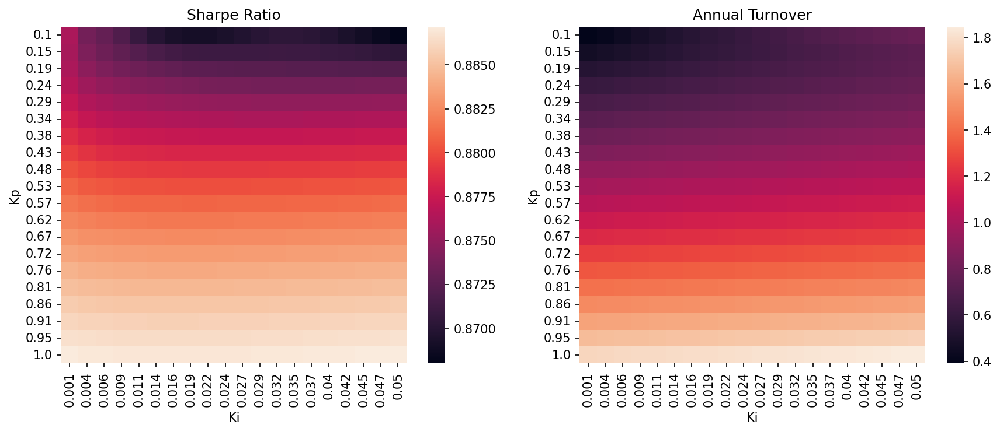

# PID Portfolio Rebalancer
### By Rohan Shah
Proportional–Integral–Derivative (PID) controllers are used in a wide variety of functions across aerospace engineering. Just as an autopilot uses a PID controller to hold a target altitude, this project applies the concept to dynamically rebalance a portfolio, holding it at a target allocation.

## Architecture
1. pid_controller.py - Creates the PIDController class, houses the calculations for the proportion, integral, and derivative terms
2. test_pid.py - Tests that pid_controller.py is calculating u correctly
3. data_pipeline.py - Uses yfinance to fetch historical closing prices
4. backtest.py - Backtests the PID strategy as well as buy and hold and threshold given a specified date range, tracking portfolio value, weight drift, and trade signals
5. analysis.ipynb - Comprehensive documentation of the project, including an introduction, mathematical foundation, equity curve analysis, statistical analysis, sensitivity analysis, weight drift analysis, and conclusion

## Methodology
The PID controller works by using the target and actual weight of any given asset in the portfolio to calculate three terms: proportion, integral and derivative. The control signal u is the sum of these terms, and is the signal to trade a stock, where 'u(t) = Kp * e(t) + Ki * sum(e * dt) + Kd * (e(t) - e(t-1)) / dt'. A full mathematical explanation is available in analysis.ipynb

## Results
1. The PID strategy had significantly less weight drift than the other two strategies, having ~20x more accuracy than the buy and hold strategy and ~5-10x more accuracy than the threshold strategy.
2. Both rebalancing strategies (PID and threshold) outperform buy and hold in market dips. However, in bull markets, buy and hold is stronger due to the lack of transaction costs. Each of the three strategies' returns were nearly identical in sideways markets.
3. Statistically, the PID strategy had a lower Sharpe ratio than the other two strategies, with a similar maximum drawdown. It also has a relatively high annual turnover of 40% at a low Kp to 96% at a high Kp.
4. The PID strategy's Sharpe Ratio is roughly constant across Kp and Ki values. Its annual turnover is largely dependent on its Kp with changes in Ki being negligible.

## How to Run
1. Install dependencies: pip install numpy pandas yfinance seaborn matplotlib
2. Run the backtest: Use backtest.py for a working example to call run_backtest, run_buy_and_hold and run_threshold
3. Open the notebook: python -m jupyterlab

## What's Next
The next part of this project will be replacing the relatively arbitrary static weights with dynamically optimised allocations utilizing Markowitz Portfolio Theory.